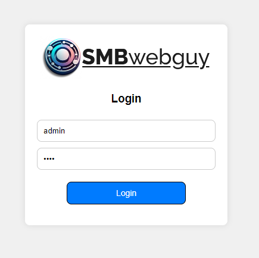
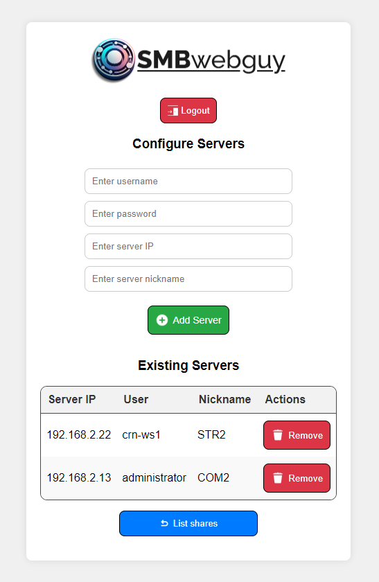
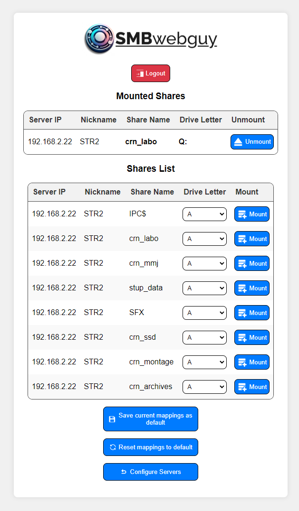
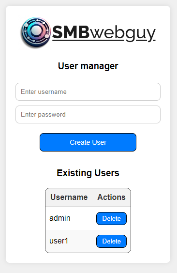

# SMBwebguy

SMBwebguy is a Flask-based web application for managing SMB shares. It allows users to log in, configure servers, and mount/unmount SMB shares.

## Features

- User authentication
- Each user can configure their own set of credentials on SMB servers
- List available shares on all configured servers for a user
- Mount and unmount shares on logical letters
- Configure, save and load a default drive mapping preset
- Default mappings are loaded when user log in and all conectiona are disconected when the user log out

## Screenshot

Here is some screenshots of the application:









## Installation
0. You can simply download the zip and run the exe from the latest release: https://github.com/Redcat468/SMBwebguy/releases
or 
1. Clone the repository:
    ```bash
    git clone https://github.com/Redcat468/SMBwebguy.git
    cd SMBwebguy
    ```

2. Create and activate a virtual environment (optional but recommended):
    ```bash
    python -m venv venv
    source venv/bin/activate  # On Windows use `venv\Scripts\activate`
    ```

3. Install the required packages:
    ```bash
    pip install -r requirements.txt
    ```

## Usage
0. Just launch the exe
or 
1. Run the Flask application:
    ```bash
    python app.py
    ```

2. Access the application in your web browser at `http://127.0.0.1:5000`.
3. Acess the user management page via `http://127.0.0.1:5000/create_user`.

## Configuration

- `users.json`: Contains user credentials.
- `servers_credentials.json`: Contains server credentials.
- `mappings.json`: Contains mappings for shares.

## License

This project is licensed under the GNU General Public License v3.0 - see the [LICENSE](LICENSE) file for details.
